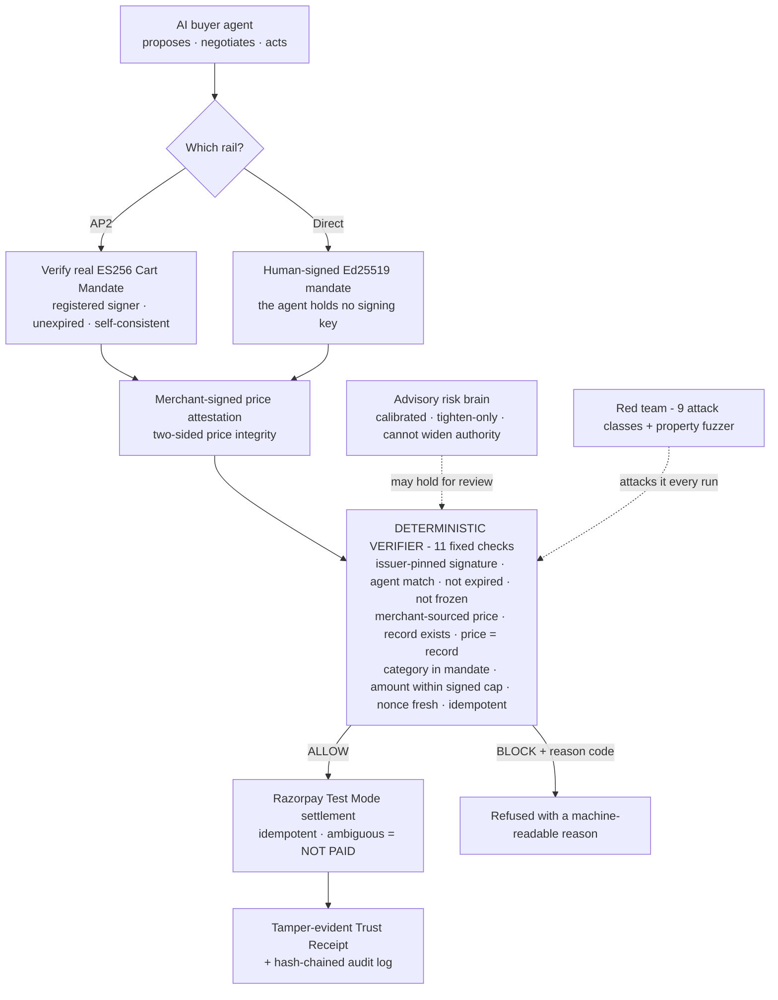

<div align="center">


<p><strong>AI agents can already spend money. BAZAAR decides whether they should be <em>allowed</em> to, on every transaction.</strong></p>

<p><em>Don't trust the agent. Test the authorization boundary.</em></p>

<p>
<a href="https://razorpay.com/"></a>
<a href="https://github.com/vedantjaiswal001/bazaar-work/actions/workflows/ci.yml"></a>
<a href="tests/"></a>
<a href="docs/EVAL.md"></a>
<a href="docs/EVAL.md"></a>
<a href="docs/EVAL.md"></a>
<a href="docs/ARCHITECTURE.md"></a>
<a href="LICENSE"></a>
</p>

<p>
<a href="https://vedantjaiswal001.github.io/bazaar-work/"><strong>Live demo (interactive)</strong></a> &nbsp;·&nbsp;
<a href="https://github.com/vedantjaiswal001/bazaar-work">GitHub repo</a> &nbsp;·&nbsp;
<a href="docs/THREAT_MODEL.md">Threat model</a> &nbsp;·&nbsp;
<a href="docs/ARCHITECTURE.md">Architecture</a> &nbsp;·&nbsp;
<a href="docs/EVAL.md">Evaluation</a> &nbsp;·&nbsp;
<a href="docs/SUBMISSION.md">Submission one-pager</a> &nbsp;·&nbsp;
<a href="docs/AUDIT.md">Self-audit</a>
</p>

</div>

---

## At a glance

|  |  |
|---|---|
| **What it is** | A deterministic authorization gate that sits between an AI agent and real money. |
| **The guarantee** | No execution path can settle above the human-signed cap, and nothing probabilistic can widen authority. |
| **The proof** | 94 tests, **100%** adversarial block, **0%** false-block, **0** fuzzer escapes over 20,000 random states. |
| **A real rail** | Verifies a genuine Google **AP2** ES256 Cart Mandate from an AI buyer, then settles it on Razorpay **Test Mode**. |
| **The honesty** | Every scoreboard number reproduces from one command. The unflattering ones are shown next to the flattering ones. |

## The one idea

**Don't trust the agent. Test the authorization boundary.** BAZAAR lets AI agents transact autonomously while ensuring that no agent, however intelligent, wrong, or malicious, can exceed **cryptographically and deterministically bounded** authority.

Give an autonomous agent a payment rail and the danger is not that it *can't* buy. It is that it can buy the **wrong thing, at the wrong price, twice, or after being told to.** BAZAAR puts a deterministic gate between the agent and the money:

> **No execution path may settle an amount greater than the signed mandate cap, and nothing probabilistic may widen authority.**

LLMs **propose**. Policies **constrain**. A deterministic verifier **authorizes**. Razorpay **executes**. Receipts **prove**. A red team **attacks it on every run**. The agent literally cannot escalate its own authority, and every refusal comes back as a specific, machine-readable reason code, never "the AI decided no."

## How it works, end to end



Understand it in ten seconds: **intelligence proposes; a fixed, cryptographic verifier, not the model, decides.**

## See it run

<div align="center">
<a href="docs/seeitrun.mp4" title="Play the full screen recording"></a>
</div>

<div align="center"><sub>A real screen recording of the <a href="https://vedantjaiswal001.github.io/bazaar-work/">live demo</a>: nine attacks fired at the gate, each blocked in real time with its own reason code. Click the image to play the full video, or open the interactive live demo. Nothing mocked.</sub></div>

## How the gate decides

<div align="center">

</div>

The gate is a **fixed checklist**, not a model. It is evaluated top to bottom; if everything passes, the payment is allowed and a signed Trust Receipt is issued. If anything fails, the first failing check emits its reason code and nothing settles. A probabilistic risk model runs alongside, but it can only ever *tighten* an ALLOW to a human-review hold. It can never authorize money or raise a limit.

> **The model is not the security boundary. The verifier is.** Under a different data distribution the advisory model's recall drops to 0.63, while the deterministic gate still blocks 100%. Intelligence *proposes*; the verifier *decides*.

## Why a deterministic gate, not an LLM judge

The obvious alternative is to ask a model "should this payment go through?" on every transaction. That is exactly the design BAZAAR rejects. The thing guarding the money has to be reproducible, bounded, and immune to the same prompt injection the agent is exposed to. Track 01 asks that every money action be **explainable, bounded, and gated**; a fixed checklist delivers all three where a model judge structurally cannot.

| On every decision | LLM-as-judge | BAZAAR's deterministic gate |
|---|---|---|
| Same input, same verdict | No: sampling and prompt drift make it non-reproducible | Yes: a pure function, identical on every run |
| Why it decided | A paragraph of prose you have to trust | Exactly one of nine machine-readable gate reason codes |
| Injected catalog text can flip it | Yes: prompt injection is an open research problem | No: untrusted text is data, never an instruction (`UNTRUSTED_INSTRUCTION`) |
| Can it exceed the signed cap | Only as bounded as the prompt it was handed | Never: the cap is a cryptographic invariant 20,000 fuzz states cannot break |
| Cost per decision | A network round-trip, hundreds of ms to seconds | About **0.13 ms** p50 in-process, roughly **7,000** authorizations/sec on one core |
| Audit | Re-running a stochastic call proves nothing | Re-run the checklist, or replay the hash-chained log, same answer |

The advisory model still has a place, it just is not the boundary: it runs alongside the gate and may only *tighten* an ALLOW to a human-review hold, never widen authority. The latency figures are real and reproducible with `make latency`; the full distribution (p50 / p95 / p99, iteration count, environment) is written to [`docs/evidence/gate_latency.json`](docs/evidence/gate_latency.json).

## The numbers that matter

Every figure here is printed by `make benchmark`, so you can reproduce them yourself. Block rates are deterministic (the gate is a fixed checklist); the fuzzer seed varies per run but the violation count is always 0. This repo never ships a fabricated number: a value not yet produced by a real run reads `UNVERIFIED`.

| Number | Value |
|---|---|
| Adversarial block rate (144 attacks, 9 classes) | **100%**, every class, correct reason code |
| False-block rate on legitimate traffic (400, incl. boundary cases) | **0%** |
| Gate held-out result (72 fresh, unseen attacks) | **100%** block, 0% false-block |
| Fuzzer: spend-cap violations over 20,000 random states | **0** |

Economic axis (same harness, no new engine): the seller's **bounded** upsell lifted average order value by **+7.72%**, with **100%** of upsold orders still clearing the same gate, a safe gate that does not kill revenue.

The advisory risk model is a **calibrated** classifier (precision **1.00**, recall **1.00**, Brier **0.038**) on a risk-model held-out set of **360 attacks + 900 legit** with fresh keys. Because these synthetic classes are separable by construction, a clean 1.00 is *expected, not magic*, so the eval leads with the **harder** signals: calibration, a **noise-robustness curve** (recall falls to ~0.82 under noise), a **leave-one-class-out** probe (mean 11%), and an **out-of-distribution** test (Generator B) where the advisory model's recall honestly **drops to 0.63 while the deterministic gate still blocks 100%**. The model is advisory: it can only *tighten* to a review hold, never widen authority. Full methodology, counts and curves in [`docs/eval/RISK_BRAIN.md`](docs/eval/RISK_BRAIN.md).

**Live settlement is a real Razorpay Test Mode payment, not a simulation.** `make live` runs one real Razorpay Test Mode order end to end, a captured payment and a reconcile that settles exactly once, with a repeated attempt refusing to double-charge. It is the one result you reproduce with your own `rzp_test_` keys rather than from the repo alone (the in-repo tests exercise the same flow against a faithful fake).

**Fast enough to sit in front of every payment.** Because the gate is a pure function with no network call and no model inference, one full authorization (all 11 checks plus the Ed25519 mandate verify) takes about **0.13 ms** at p50 and stays **well under a millisecond** at p99, roughly **7,000** authorizations per second on a single core in this environment. Reproduce with `make latency`; the exact distribution and the machine it ran on are recorded in [`docs/evidence/gate_latency.json`](docs/evidence/gate_latency.json).

## Why this grows commerce, not just guards it

Track 01 pairs *growth* with *agentic commerce* because they are the same problem: agentic commerce does not scale until the authorization is trustworthy. A merchant will not let an autonomous agent spend against its catalog, and a person will not hand a card to an agent, without a boundary they can verify. Trust is the unlock, and it is exactly what "let the agent pay" demos leave out.

BAZAAR is that unlock, and it does not tax growth to buy safety. The *same* gate that blocks 100% of attacks let a **bounded upsell lift average order value by +7.72%**, with **100% of upsold orders still clearing the gate**, so revenue and safety moved together rather than against each other. And because a decision is a deterministic **0.13 ms** checklist rather than an LLM round-trip, the boundary can sit in front of *every* transaction at commerce scale with no added latency and no per-call model cost. Verifiable authorization is what lets a merchant say **yes** to AI buyers, and saying yes is where the growth is. The architecture is production-ready and deployed live; it settles on Razorpay Test Mode today and is one key-swap from production, refusing any non-test key as a safety guard.

## Nine attacks, nine reason codes

A compromised buyer or seller agent tries every way to cheat. Each is blocked with a specific code the rest of a system can log and alert on.

| Attack | Reason code |
|---|---|
| Spend above the signed cap | `MANDATE_LIMIT_EXCEEDED` |
| Rewrite the mandate, or self-issue one with its own key | `MANDATE_IMMUTABLE` |
| Lie about the price, or change it after authorization | `PRICE_MISMATCH_MERCHANT_RECORD` |
| Replay a nonce | `NONCE_REPLAY` |
| Resubmit a paid transaction | `DUPLICATE_TRANSACTION` |
| Buy an off-mandate category | `CATEGORY_OUTSIDE_MANDATE` |
| Smuggle an instruction through catalog text | `UNTRUSTED_INSTRUCTION` |
| Transact after being frozen | `AGENT_FROZEN` |
| Use an expired mandate | `MANDATE_EXPIRED` |

Full mapping of attack to defense in [`docs/THREAT_MODEL.md`](docs/THREAT_MODEL.md).

## Sellable to a real AI buyer: the AP2 rail

This is Track 01's second acceptance path, *"make a merchant transactable by an AI buyer end to end,"* built for the protocol race the track's own *why now* names (ACP, AP2, x402, NPCI's UAP). BAZAAR doesn't only defend its own mandates; it accepts a real, agent-standard payment authorization. A buyer's credential provider signs an **ES256 Cart Mandate** (Google's Agent Payments Protocol); BAZAAR verifies its authenticity (registered signer, unexpired, self-consistent), then settles it through the **same untouched 11-check gate**. Authenticity is AP2's job; money is the gate's.

`python scripts/ap2_demo.py` (or `make ap2`): **1/1** legit carts clear, **5/5** tampers caught, a price tamper and an over-budget cart at the money gate; an expired, signature-tampered, or unregistered-signer cart at AP2 verification, *before* the gate. 12 tests in `tests/integration/test_ap2.py`. Full write-up in [`docs/AP2_RAIL.md`](docs/AP2_RAIL.md).

## Two-sided price integrity: merchant-as-signer

Both sides of a purchase are signed. The buyer's mandate is issuer-signed and issuer-pinned; the merchant signs a price attestation (Ed25519) over the price it will honor, verified against a trusted merchant key. When it verifies, the gate authorizes against that merchant-signed price and the receipt is marked dual-signed. The gate then enforces that the authorized amount equals the merchant-of-record price and stays within the signed cap, so tampering the mandate fails its issuer-pinned signature (`MANDATE_IMMUTABLE`) and tampering the price fails the gate's price check (`PRICE_MISMATCH_MERCHANT_RECORD`). Price integrity is signed on both sides, and the gate, not a bare value guess, is what enforces it. See [`backend/bazaar/catalog/attestation.py`](backend/bazaar/catalog/attestation.py).

## Try it in 60 seconds

```bash
make setup       # venv + install + initialize the database
make showcase    # the whole story in one command: ALLOW, tamper-fail,
                 # 9 attacks blocked, audit chain, live-computed scoreboard
```

Everything else:

```bash
make test        # 94 tests: unit + property + security + integration
make fuzz        # property-based fuzzer against the spend-cap invariant
make benchmark   # regenerate datasets, run the gate + fuzzer, print the scoreboard
make latency     # time one real authorization decision through the gate (p50/p99)
make train       # train + evaluate the calibrated risk brain (writes the artifact + plots)
make ap2         # AP2 rail conformance: real ES256 Cart Mandates (1/1 legit, 5/5 tampers)
make verify      # receipt verify/tamper + audit-chain verify/tamper
make run         # FastAPI backend on :8000   (make web for the UI on :5173)
```

**One real Razorpay Test Mode payment**, end to end, no webhook tunnel. Copy `.env.example` to `.env`, add your `rzp_test_` keys, then:

```bash
make live        # gate ALLOWs -> real order on Razorpay -> pay with a test
                 # method -> reconcile settles once -> idempotency proven live
make live-fake   # the same flow with no network and no keys (a dry run)
```

No real money ever moves: the client refuses any key that is not `rzp_test_`.

## The console, on real screens

A single **Razorpay-brand** console (React + TypeScript + Vite) drives the real backend, nothing mocked. Pick an AI buyer, a real AP2 signed cart or a red-team attack, and watch the pipeline advance: the AP2 verification and the 11-check gate resolve in real time, a hash-chained audit log streams, and a signed Trust Receipt issues. A **Results** tab reads the live `make benchmark` scoreboard.

```bash
make run     # FastAPI backend on :8000   (terminal 1)
make web     # the console on :5173       (terminal 2)  ->  open http://localhost:5173
```

## What BAZAAR builds: eight components

1. **Intent Compiler and Signed Mandate** - natural-language request to structured mandate; the human confirms the rendered mandate, then it is Ed25519-signed and locked with a generous but bounded TTL. The agent never holds the signing key.
2. **Deterministic Authorization Gate** - the heart: a fixed 11-check checklist (signature by a trusted issuer, mandate binds the agent, not expired, agent not frozen, money-field is merchant-sourced, record exists, price == merchant of record, category in allowlist, amount within the cap, nonce unused, not already executed) to ALLOW or one reason code.
3. **Buyer and Seller Agents + Bounded Negotiation** - one negotiation round clamped between the buyer's cap and the seller's floor, both visible on screen.
4. **Razorpay Test Mode Settlement** - real Orders + Payments with idempotency and verified webhooks; the ambiguous window defaults to "not paid," reconciles from Razorpay, and never re-charges.
5. **Trust Receipt + Hash-Chained Audit Log** - every authorization emits a signed receipt; each log entry chains the previous entry's hash, making the whole log tamper-evident without a blockchain.
6. **Red-Team Harness + Benchmark** - an adversarial agent attacks the live gate across nine classes; a property-based fuzzer attacks the core invariant; the benchmark measures block rates, false-block rate, and honest escapes.
7. **AP2 Rail Adapter** - verifies a real ES256 Cart Mandate (Google's Agent Payments Protocol) and maps it into the canonical Mandate + transaction, so a genuine AI buyer can transact through the same untouched gate (`backend/bazaar/adapters/ap2.py`).
8. **Calibrated Risk Brain + Merchant-as-Signer** - a calibrated advisory classifier (recall 1.00 at zero false positives, interpretable weights) and Ed25519 merchant price attestations, so both the buyer's cap and the merchant's price are signed and the gate enforces the authorized amount against the merchant-of-record price.

## The boundary that must not blur

The deterministic `verifier/` imports **nothing** from the LLM or agent layer. This is enforced by `tests/security/test_module_boundary.py`, which fails the build if the trusted core ever imports the probabilistic layer. Full module map in [`docs/ARCHITECTURE.md`](docs/ARCHITECTURE.md).

```
bazaar/
├── backend/     intent/ policy/ verifier/ risk/ adapters/ crypto/ catalog/ agents/ razorpay/ receipt/ ledger/ db/ api/ redteam/
├── frontend/    live Razorpay-brand console (React + TS + Vite)
├── tests/       unit/ integration/ property/ security/
├── benchmarks/  one-command runner -> scoreboard
├── docs/        THREAT_MODEL · ARCHITECTURE · EVAL · SUBMISSION · AP2_RAIL · AUDIT · eval/RISK_BRAIN
├── scripts/     demo · showcase · live_razorpay · verify_chain · train_risk · ap2_demo · bench_latency
└── Makefile     setup · test · fuzz · benchmark · latency · train · ap2 · showcase · verify · live · run
```

## Honesty rules this repo holds itself to

- **No fabricated results, ever.** Numbers come from commands that actually ran. Anything not yet run reads `UNVERIFIED`.
- **Continuous proof, not a one-time claim.** Every push reruns the full suite, the benchmark, the AP2 rail, and the fuzzer on a clean machine via GitHub Actions; the CI badge above is green only when all 94 tests pass, the benchmark reports zero escapes, and the fuzzer finds zero violations.
- **Reason codes, not vibes.** Every block returns a machine-readable code, and every metric is reproducible from a seed.
- **The unflattering number gets reported too.** The risk model's recall is shown next to its precision, and its out-of-distribution recall (0.63) is shown next to its clean-set recall (1.00).
- **Secrets never in git.** `.env` is git-ignored; `.env.example` shows the shape.
- **Never hand-rolled crypto.** Ed25519 via libsodium (PyNaCl); canonical JSON via `rfc8785`.

## Known limitations (stated, not hidden)

A strong submission names what it does *not* solve. BAZAAR deliberately does not claim these:

- **No real-world fraud accuracy is claimed.** The risk model is evaluated on *synthetic* data whose classes are separable by construction, so the perfect clean-set score is *expected*. The eval reports calibration, a noise-robustness curve, and a leave-one-class-out limit instead of presenting 1.00/1.00 as production fraud performance. The **deterministic gate**, not the model, is the security guarantee.
- **The risk model does not transfer to novelty.** Held-out mandates use fresh keys, and a second generator (Generator B) tests distribution shift: recall drops to 0.63 there, and a leave-one-class-out probe drops to an 11% mean. The gate blocks 100% in every one of those cases, which is the point.
- **One real rail is implemented: AP2.** x402 and NPCI's UAP interoperability are future work, not in this submission. The AP2 bridge verifies ES256-signed, single-line Cart Mandates; full SD-JWT selective disclosure and multi-item carts are future.
- **No hierarchical delegation.** Authority is bounded by issuer-key pinning (an agent cannot self-issue a bigger mandate) and the signed cap, not by parent/child delegation limits (UPI-Circle-style), which are out of scope.
- **The signed cap is a per-transaction ceiling, not a running budget.** Every authorization enforces `amount <= cap`, and replay or double-charge of the *same* transaction is blocked in the schema; but the gate does not yet sum spend across many *distinct* purchases under one mandate within its TTL. Cumulative-budget and velocity limits are stated future work, not a claim made here.
- **Single-currency by construction.** Money is compared as integer paise and the catalog is INR throughout; the gate does not yet cross-check a currency field between mandate, record, and cart. Multi-currency support (and the currency-equality check that must come with it) is future work.
- **The live Razorpay payment needs your keys.** `make live` performs one real Test Mode order and an interactive test-card payment; it needs your own `rzp_test_` keys and is not part of the keyless test suite. Everything else reproduces from the repo alone.
- **No real money, marketplace, reputation graph, or blockchain.** Settlement is Razorpay **Test Mode** only.

## License

MIT, see [`LICENSE`](LICENSE).

Built by **Vedant Jaiswal** for the Razorpay AI Buildathon 2026.
